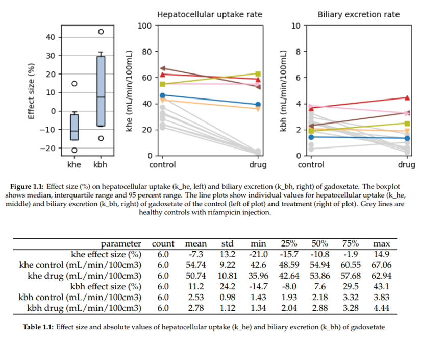

---

## Measuring drug-induced inhibition of liver transporters

[](https://www.apache.org/licenses/LICENSE-2.0) [](https://creativecommons.org/licenses/by/4.0/) [](https://doi.org/10.5281/zenodo.15512550)


## 📚 Context 

The liver is responsible for filtering waste products from the blood, and evacuating these by excreting them to bile. Drugs commonly affect these procesesses, potentially leading to toxic side effects.

If a drug inhibits excretion into the bile, then harmful material can get stuck in liver cells and cause damage to the liver. This is commonly referred to as drug-induced liver injury (DILI). If a drug on the other hand blocks the uptake of these materials into the liver, they will circulate in the blood for too long and may cause harm elsewehere.

When dealing with novel drugs, either in basic research or drug development, it is often unknown to what extent a drug affects the uptake or excretion into the liver. This can expose trial participants to significant risk, or even patients in clinical practice if the risk is not identified during development.

In order to mitigate these risks, the [TRISTAN project](https://www.imi-tristan.eu/) developed an MRI-based method to measure the effect of drugs in liver transporters directly. Proof of concept was provided in preclinical studies and pilot studies in humans, showing that the method is able to detect inhibition of uptake and excretion caused by drugs. 

The pipeline in this repository was used to generate the results in humans. It can be used to reproduce them independently, but also to analyse new data acquired in the same way. 

## 🛠️ Methodology 

The **input** to the pipeline is signal-time curves in regions-of-interest in the liver and aorta, using a dynamic gadoxetate-enhanced MRI acquisition, of any number of human subjects. These data are derived from MRI after image processing steps including motion correction and segmentation. These steps are not included in this pipeline but will be published separately (*coming soon*).

The **output** of the pipeline is measurements of gadoxetate uptake rates into hepatocytes, and excretion rates into bile. For each drug, the pipeline generates numerical results for each trial subject, creates plots, performs statistical analysis and summarises all results in pdf reports. The results are saved in the *build* directory in the main folder. 

The basic methodology is gradient descent-type fitting of a model of gadoxetate kinetics and MRI signal formation in the liver. The core model fitting engine is the python package [dcmri](www.dcmri.org) - specifically the function [AortaLiver2scan](https://dcmri.org/api/dcmri.AortaLiver2scan.html). Secondary analyses are produced on the fly, such analysis of 1-scan data and with different acquisition times.

## 💻 Usage

The pipeline can be run after installing the requirements:

```console
pip install -r requirements.txt
```

The entry scripts are *src/reproduce.py* and *src/newdrug.py*. The outputs are saved in the build folder. By default this contains the output generated by *reproduce.py*.

In order to **reproduce the published results**, delete the *build* folder and run the script *src/reproduce.py*. The entire calculation may take several hours on a laptop computer. The pipeline will download its input data from [a public archive](https://zenodo.org/records/15301607) with gadoxetate kinetic data measured by the TRISTAN consortium in humans. These studies provide measurements for three drugs (rifampicin, metformin and ciclosporin) as well as some control subjects. The local copy of the data is deleted after completion of the analysis. 

In order to **analyse a new drug** with the same method, perform the following steps:

1. Acquire data as laid out in the [experimental protocol](https://archive.ismrm.org/2024/4015.html) and derive signal-time curves (miblab pipeline for this part coming soon).

2. Save your data in [dmr format](https://openmiblab.github.io/pydmr/format.html) in the same way as the datasets on [the public archive](https://zenodo.org/records/15301607).

3. Then run the script *src/newdrug.py* making sure to replace the placeholder values by those that describe your data. When the computation finishes, the results will be added to the build folder.

## 	📄 Code structure

The **build** folder contains the output of the the *reproduce.py* script as an example. It can be deleted and will be fully rebuilt when running the script. 

The **src** folder contains all the source code, with the top level entry scripts *reproduce.py* and *newdrug.py*. These call functions in the subfolders *methods* and *strudies*.

## ❤️ Citation 

Thazin Min, Marta Tibiletti, Paul Hockings, Aleksandra Galetin, Ebony Gunwhy, Gerry Kenna, Nicola Melillo, Geoff JM Parker, Gunnar Schuetz, Daniel Scotcher, John Waterton, Ian Rowe, and Steven Sourbron. Measurement of liver function with dynamic gadoxetate-enhanced MRI: a validation study in healthy volunteers. [Proc Intl Soc Mag Reson Med, Singapore 2024, 4015](https://archive.ismrm.org/2024/4015.html).

## 💰 Funding 

The work was performed as part of the [TRISTAN project](https://www.imi-tristan.eu/) on imaging biomarkers for drug toxicity. The project was EU-funded through the [Innovative Health Initiative](https://www.ihi.europa.eu/).

[](https://www.imi-tristan.eu/)

## 👥 Contributors

<!-- ALL-CONTRIBUTORS-LIST:START - Do not remove or modify this section -->
<!-- prettier-ignore-start -->
<!-- markdownlint-disable -->
<table>
  <tbody>
    <tr>
      <td align="center" valign="top" width="14.28%"><a href="https://github.com/EbonyGunwhy"><br /><sub><b>Ebony Gunwhy</b></sub></a><br /></td>
      <td align="center" valign="top" width="14.28%"><a href="https://github.com/EShalom"><br /><sub><b>Eve Shalom</b></sub></a><br /></td>
      <td align="center" valign="top" width="14.28%"><a href="https://github.com/plaresmedima"><br /><sub><b>Steven Sourbron</b></sub></a><br /></td>
    </tr>
  </tbody>
</table>

<!-- markdownlint-restore -->
<!-- prettier-ignore-end -->

<!-- ALL-CONTRIBUTORS-LIST:END -->

